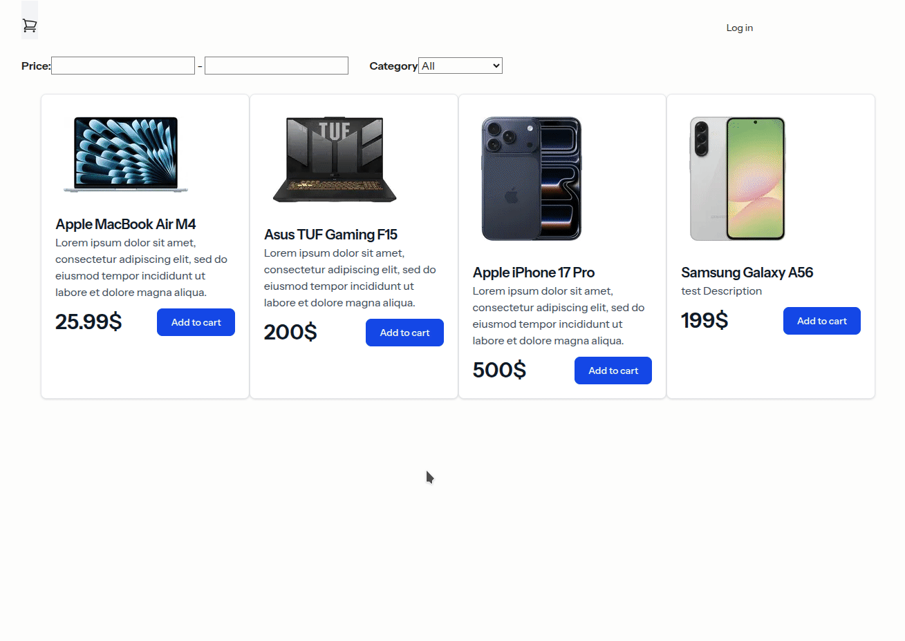

# Description
A small demo ecommerce module (shop).

# Demo



# Installation

```shell
git clone https://github.com/razielin/ecommerce-test
cd ecommerce-test
```
Installing dependencies
```shell
composer install
npm install
```
Run database migrations
```shell
php artisan migrate
php artisan db:seed
```
Run the app
```shell
composer run dev
```
open the app
```
http://localhost:8000/
```

# Run unit tests
```shell
php artisan test
```
# Demo admin account
```shell
http://localhost:8000/login
```
Login: admin@admin.com

Password: admin
